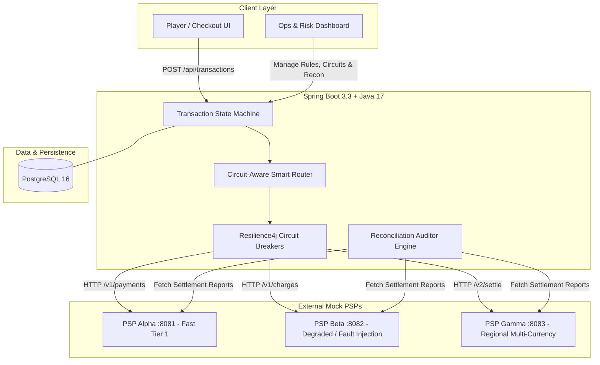

# SettleFlow — Intelligent Payment Orchestration & Reconciliation Engine

[](https://github.com/moni-sm/settleflow/actions)
[](https://www.docker.com/)
[](https://kubernetes.io/)
[](https://openjdk.org/)
[](https://spring.io/projects/spring-boot)
[](https://nextjs.org/)

> 🚀 **Live Application**: [SettleFlow](https://prefers-ringtone-cet-focus.trycloudflare.com/) *(Preloaded with 1-click demo accounts for Operations & Player Checkout)*

---

## 📌 Executive Summary

**SettleFlow** is an enterprise-grade Payment Orchestration and Reconciliation Platform built for high-volume merchants, global ecommerce platforms, and iGaming operators.

It solves core fintech operational challenges:
- **Zero Payment Outages**: Dynamically routes traffic away from failing Payment Service Providers (PSPs) using real-time **Resilience4j Circuit Breakers**.
- **Maximized Authorization Rates**: Enforces priority rules, currency matching, and automatic multi-tier failovers.
- **Financial Compliance & Automated Reconciliation**: Continuously cross-audits internal transactional ledgers against external PSP settlement reports to flag and resolve discrepancies (`AMOUNT_MISMATCH`, `STATUS_MISMATCH`, `MISSING_IN_PSP`).
- **Cloud-Native Resilience**: Fully containerized and orchestratable on **Kubernetes (K8s)** and **Docker Compose** with end-to-end CI/CD.

---

## 🏗️ Architecture Overview



---

## ✨ Key Engineering Highlights

### 1. Intelligent Circuit-Aware Routing
- Evaluates transactions by **Currency (EUR, GBP, USD, etc.)**, **Transaction Volume**, and **Provider Priority**.
- Monitors live failure rates and response latency. If a PSP degrades or times out, the circuit breaker transitions (`CLOSED` $\to$ `OPEN`) and automatically re-routes payments to healthy secondary providers without dropping customer transactions.

### 2. Strict State Machine Lifecycle
- Enforces atomic transactional transitions:
  $$\text{PENDING} \longrightarrow \text{ROUTING} \longrightarrow \text{PROCESSING} \longrightarrow \begin{cases} \text{SETTLED} \\ \text{RETRYING} \longrightarrow \text{FAILED} \\ \text{REFUNDED} \end{cases}$$
- Built with database idempotency protection to prevent double charges across concurrent network calls.

### 3. Automated Settlement Reconciliation Engine
- Cross-references internal database transactions with external PSP settlement reports.
- Classifies ledger status:
  - `MATCHED` — Records align in amount and settlement status.
  - `AMOUNT_MISMATCH` — Currency or amount discrepancies between ledger and provider.
  - `STATUS_MISMATCH` — Discrepancies in final state (e.g. `SETTLED` in DB vs `PROCESSING` in PSP).
  - `MISSING_IN_PSP` / `MISSING_IN_DB` — Unsettled or untracked transactions.
- Provides audit trails with compliance logging and manual resolution workflows.

---

## 🛠️ Technology Stack

| Layer | Technologies |
| :--- | :--- |
| **Backend Core** | Java 17 LTS, Spring Boot 3.3, Spring Data JPA, Hibernate, Resilience4j |
| **Frontend UI** | Next.js 14 (App Router), React 18, TypeScript, Tailwind CSS, Lucide Icons |
| **Database** | PostgreSQL 16 (Production) / H2 (In-Memory Tests) |
| **Microservices** | Node.js (Mock PSP Microservices on ports 8081, 8082, 8083) |
| **Container & Cloud** | Docker, Docker Compose, Kubernetes (K8s Kustomize, Deployments, PVCs, CronJobs) |
| **CI / CD** | GitHub Actions (Automated Tests, Buildx Multi-Arch Images to GHCR) |

---

## 💻 Local Quickstart

### Option 1: Docker Compose (Full Stack)
```bash
docker compose up --build
```
- **Frontend UI**: `http://localhost:3000`
- **Backend API**: `http://localhost:8080/api/transactions`
- **PSP Mocks**: Ports `8081`, `8082`, `8083`

### Option 2: Kubernetes (K8s)
```bash
kubectl apply -k k8s/
kubectl port-forward svc/frontend-service 3000:3000 -n settleflow
kubectl port-forward svc/backend-service 8080:8080 -n settleflow
```

---

## 📡 REST API Reference

| Method | Endpoint | Description |
| :--- | :--- | :--- |
| `POST` | `/api/transactions` | Initiate transaction & execute routing state machine |
| `GET` | `/api/transactions` | Retrieve all transactions with provider settlement status |
| `POST` | `/api/transactions/{id}/refund` | Issue customer refund |
| `GET` | `/api/psps` | Retrieve registered PSPs with live CircuitBreaker metrics |
| `POST` | `/api/psps/{id}/circuit-override` | Manual circuit breaker override (`OPEN` / `CLOSED` / `HALF_OPEN`) |
| `GET` | `/api/routing-rules` | List active payment routing rules |
| `POST` | `/api/routing-rules` | Create/update dynamic payment routing rule |
| `POST` | `/api/reconciliation/run` | Trigger automated settlement audit run |
| `GET` | `/api/reconciliation/discrepancies` | List flagged settlement discrepancies |
| `POST` | `/api/reconciliation/discrepancies/{id}/resolve` | Resolve discrepancy with audit justification notes |
| `GET` | `/api/players` | Query player KYC tiers and transaction limits |
| `GET` | `/api/audit-logs` | Retrieve compliance audit trail logs |

---

## 🛡️ License
MIT License
