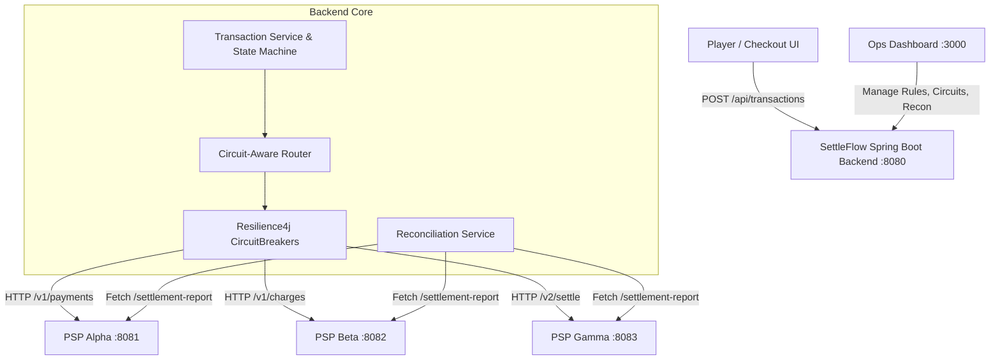

# SettleFlow — Intelligent Payment Orchestration Platform

SettleFlow is an enterprise payment orchestration platform designed for high-volume merchants and iGaming operators. It dynamically routes transactions across multiple Payment Service Providers (PSPs), implements circuit-breaking resilience with automated failover, and reconciles internal ledgers against PSP settlement reports.

---

## 🚀 Quick Access & Live Portals

| Portal | Route | Default Credentials | Purpose |
| :--- | :--- | :--- | :--- |
| **Main Sign-In Gateway** | [`/`](http://localhost:3000) | *1-Click Demo Buttons Available* | Unified secure authentication portal |
| **Operations Dashboard** | [`/dashboard`](http://localhost:3000/dashboard) | `ops@settleflow.dev` / `demo1234` | Real-time transaction monitor, circuit kill switches, KYC & rules engine |
| **Player Checkout Portal** | [`/checkout`](http://localhost:3000/checkout) | `player@settleflow.dev` / `demo1234` | Multi-currency deposit & withdrawal flows with live routing state tracker |

---

## 🏗️ Architecture & Component Overview



### System Components:
1. **Frontend (`frontend/`)**: Next.js 14 (App Router) + TypeScript + Tailwind CSS
   - **Main Sign-In (`/`)**: Clean authentication gateway with role-based auto-redirects.
   - **Checkout Portal (`/checkout`)**: Multi-currency deposit & withdrawal flows with live status tracking.
   - **Operations Dashboard (`/dashboard`)**: Real-time transaction monitoring, manual circuit breaker overrides (kill switches), routing rules engine, player KYC limits, audit logging, and automated reconciliation auditor.
2. **Backend Orchestrator (`backend/`)**: Spring Boot 3.3 + Java 17 + JPA (PostgreSQL / H2)
   - **State Machine**: Enforces strict transitions (`PENDING` $\to$ `ROUTING` $\to$ `PROCESSING` $\to$ `SETTLED` / `RETRYING` $\to$ `FAILED` / `REFUNDED`).
   - **Resilience4j Circuit Breakers**: Configured per PSP instance (`psp-alpha`, `psp-beta`, `psp-gamma`). Fast-fails degraded PSPs and probes recovery in `HALF_OPEN` state.
   - **Circuit-Aware Routing Router**: Matches transaction currency, amount, and traffic weights while dynamically bypassing unhealthy PSPs.
   - **REST APIs**: Full CRUD for routing rules, circuit controls, transactions, KYC tiers, and reconciliation runs.
3. **Mock PSP Microservices (`psp-mocks/`)**: Standalone lightweight Node.js servers
   - **PSP Alpha (`port: 8081`)**: Fast tier-1 provider (5% failure rate, ~120ms latency).
   - **PSP Beta (`port: 8082`)**: Unstable provider (60% failure rate, ~750ms latency) for demoing circuit trip & failover.
   - **PSP Gamma (`port: 8083`)**: Multi-currency regional provider (15% failure rate, ~250ms latency).
   - Live endpoints: `/configure` (adjust latency and failure rates on the fly), `/settlement-report` (ledger export for audit).
4. **Reconciliation Engine (`reconciliation/`)**:
   - Standalone Python CLI (`reconcile.py`) auditing internal database transactions against PSP settlement reports.
   - Accurately classifies: `MATCHED`, `MISSING_IN_DB`, `MISSING_IN_PSP`, `AMOUNT_MISMATCH`, `STATUS_MISMATCH`.

---

## 🐳 Docker & Docker Compose Setup

Run the full SettleFlow stack with a single command:

```bash
docker compose up --build
```

This starts:
- `settleflow-postgres`: PostgreSQL 16 on `localhost:5432`
- `settleflow-psp-mocks`: Mock PSP microservices on ports `8081`, `8082`, `8083`
- `settleflow-backend`: Spring Boot 3.3 Backend API on `localhost:8080`
- `settleflow-frontend`: Next.js 14 Dashboard & Checkout on `http://localhost:3000`
- `settleflow-recon`: Automated settlement audit worker

---

## ☸️ Kubernetes Deployment (`k8s/`)

Deploy all microservices to your Kubernetes cluster with Kustomize:

```bash
# 1. Create namespace, configs, PVCs, services, deployments, and ingress
kubectl apply -k k8s/

# 2. Check deployment status
kubectl get pods -n settleflow

# 3. Port-forward frontend & backend for local access
kubectl port-forward svc/frontend-service 3000:3000 -n settleflow
kubectl port-forward svc/backend-service 8080:8080 -n settleflow
```

---

## 💻 Native Local Run (No Docker)

```bash
# Terminal 1 — Start Mock PSP Microservices
cd psp-mocks
node server.js

# Terminal 2 — Start Spring Boot Backend
cd backend
.\mvnw.cmd spring-boot:run   # Windows
./mvnw spring-boot:run       # macOS / Linux

# Terminal 3 — Start Next.js Frontend
cd frontend
npm run dev

# Terminal 4 — Run Reconciliation Audit
cd reconciliation
python reconcile.py
```

---

## 📡 REST API Summary

| Method | Endpoint | Description |
| :--- | :--- | :--- |
| `POST` | `/api/transactions` | Create transaction & drive state machine |
| `GET` | `/api/transactions` | List all transactions with status and PSP details |
| `GET` | `/api/transactions/{id}` | Get single transaction detail |
| `POST` | `/api/transactions/{id}/refund` | Issue customer refund |
| `GET` | `/api/psps` | Get registered PSPs with live CircuitBreaker metrics |
| `POST` | `/api/psps/{id}/circuit-override` | Manually flip circuit breaker (`OPEN`/`CLOSED`/`HALF_OPEN`) |
| `GET` | `/api/routing-rules` | List active routing rules |
| `POST` | `/api/routing-rules` | Create routing rule |
| `PUT` | `/api/routing-rules/{id}` | Update routing rule |
| `DELETE` | `/api/routing-rules/{id}` | Delete routing rule |
| `POST` | `/api/reconciliation/run` | Trigger settlement reconciliation run |
| `GET` | `/api/reconciliation/runs` | List historical reconciliation batches |
| `GET` | `/api/reconciliation/discrepancies` | List discrepancy items |
| `POST` | `/api/reconciliation/discrepancies/{id}/resolve` | Resolve discrepancy with audit notes |
| `GET` | `/api/players` | List player KYC tiers and spending limits |
| `GET` | `/api/audit-logs` | Retrieve platform compliance audit logs |

---

## 🛡️ License
MIT
